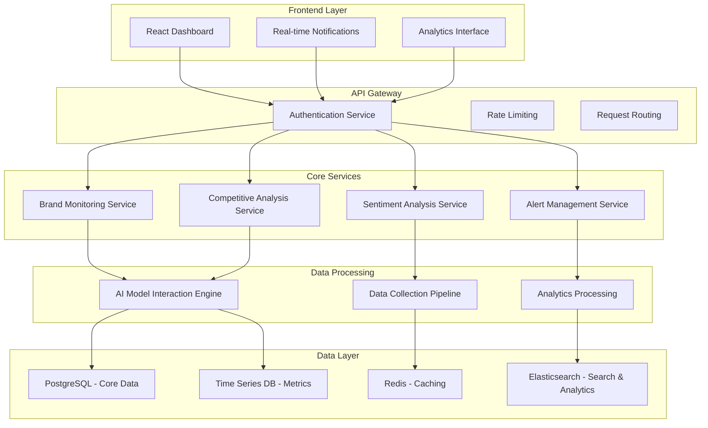

# Design Document - LLM Brand Monitoring Platform

## Overview

The LLM Brand Monitoring Platform is a comprehensive web application that provides brands with deep insights into their visibility and performance across AI-powered search engines and language models. The platform combines real-time monitoring, competitive analysis, sentiment tracking, and optimization recommendations to help brands navigate the evolving AI-driven search landscape.

The system architecture follows a microservices approach with a React-based frontend, Node.js backend services, and specialized data processing pipelines for AI model interaction and analysis.

## Architecture

### High-Level Architecture



### Technology Stack

**Frontend:**
- React 18 with TypeScript
- Material-UI for component library
- Chart.js for data visualization
- Socket.io for real-time updates
- React Query for state management

**Backend:**
- Node.js with Express.js
- TypeScript for type safety
- JWT for authentication
- Socket.io for real-time communication
- Bull Queue for job processing

**Data Storage:**
- PostgreSQL for relational data
- Redis for caching and sessions
- Elasticsearch for search and analytics
- InfluxDB for time-series metrics

**External Integrations:**
- OpenAI API for AI model interactions
- Anthropic Claude API for additional AI insights
- Google Search API for baseline comparisons
- Various social media APIs for mention tracking

## Components and Interfaces

### Core Components

#### 1. Brand Monitoring Service
**Purpose:** Central service for tracking brand visibility across AI platforms

**Key Methods:**
```typescript
interface BrandMonitoringService {
  trackBrandVisibility(brandId: string, queries: string[]): Promise<VisibilityMetrics>
  getPerformanceTrends(brandId: string, timeRange: TimeRange): Promise<TrendData>
  updateVisibilityScores(brandId: string): Promise<void>
  generatePerformanceReport(brandId: string): Promise<PerformanceReport>
}
```

**Responsibilities:**
- Execute AI queries for brand monitoring
- Calculate visibility scores and rankings
- Track performance trends over time
- Generate comprehensive performance reports

#### 2. AI Model Interaction Engine
**Purpose:** Handles communication with various AI models and platforms

**Key Methods:**
```typescript
interface AIModelEngine {
  queryModel(model: AIModel, prompt: string): Promise<AIResponse>
  extractCitations(response: AIResponse): Promise<Citation[]>
  analyzeSentiment(response: AIResponse): Promise<SentimentScore>
  categorizeResponse(response: AIResponse): Promise<ResponseCategory>
}
```

**Responsibilities:**
- Manage API connections to multiple AI platforms
- Execute standardized queries across different models
- Extract and parse AI responses for analysis
- Handle rate limiting and error recovery

#### 3. Competitive Analysis Service
**Purpose:** Provides competitive intelligence and benchmarking

**Key Methods:**
```typescript
interface CompetitiveAnalysisService {
  compareVisibility(brandId: string, competitorIds: string[]): Promise<ComparisonReport>
  trackMarketShare(brandId: string): Promise<MarketShareData>
  identifyOpportunities(brandId: string): Promise<Opportunity[]>
  generateBenchmarkReport(brandId: string): Promise<BenchmarkReport>
}
```

**Responsibilities:**
- Execute comparative analysis across brands
- Calculate market share and positioning
- Identify competitive gaps and opportunities
- Generate benchmarking reports

#### 4. Alert Management Service
**Purpose:** Manages real-time alerts and notifications

**Key Methods:**
```typescript
interface AlertService {
  createAlert(userId: string, alertConfig: AlertConfig): Promise<Alert>
  evaluateThresholds(brandId: string, metrics: Metrics): Promise<Alert[]>
  sendNotification(alert: Alert, channels: NotificationChannel[]): Promise<void>
  manageAlertPreferences(userId: string, preferences: AlertPreferences): Promise<void>
}
```

**Responsibilities:**
- Monitor metrics against defined thresholds
- Generate and dispatch alerts
- Manage user notification preferences
- Handle alert escalation and acknowledgment

### Data Models

#### Brand Model
```typescript
interface Brand {
  id: string
  name: string
  domain: string
  industry: string
  competitors: string[]
  monitoringKeywords: string[]
  alertThresholds: AlertThreshold[]
  createdAt: Date
  updatedAt: Date
}
```

#### Visibility Metrics Model
```typescript
interface VisibilityMetrics {
  brandId: string
  timestamp: Date
  overallScore: number
  rankingPosition: number
  mentionFrequency: number
  sentimentScore: number
  citationCount: number
  sourceQuality: number
  geographicBreakdown: GeographicMetric[]
}
```

#### AI Response Model
```typescript
interface AIResponse {
  id: string
  modelName: string
  query: string
  response: string
  citations: Citation[]
  sentiment: SentimentScore
  timestamp: Date
  brandMentions: BrandMention[]
  confidence: number
}
```

#### Citation Model
```typescript
interface Citation {
  id: string
  url: string
  domain: string
  title: string
  authority: number
  relevance: number
  lastUpdated: Date
  contentType: string
}
```

## Error Handling

### Error Categories

1. **API Integration Errors**
   - AI model API failures
   - Rate limiting exceeded
   - Authentication failures
   - Network timeouts

2. **Data Processing Errors**
   - Invalid response parsing
   - Data validation failures
   - Database connection issues
   - Cache misses

3. **Business Logic Errors**
   - Invalid brand configurations
   - Threshold calculation errors
   - Report generation failures
   - Alert processing errors

### Error Handling Strategy

```typescript
class ErrorHandler {
  static handleAPIError(error: APIError): ErrorResponse {
    switch (error.type) {
      case 'RATE_LIMIT':
        return { retry: true, delay: error.retryAfter }
      case 'AUTH_FAILURE':
        return { retry: false, action: 'REFRESH_TOKEN' }
      case 'NETWORK_TIMEOUT':
        return { retry: true, delay: 5000, maxRetries: 3 }
      default:
        return { retry: false, action: 'LOG_AND_ALERT' }
    }
  }
}
```

### Resilience Patterns

- **Circuit Breaker:** Prevent cascading failures from AI API outages
- **Retry with Exponential Backoff:** Handle temporary failures gracefully
- **Fallback Mechanisms:** Use cached data when real-time data is unavailable
- **Health Checks:** Monitor service health and automatically recover

## Testing Strategy

### Unit Testing
- **Coverage Target:** 90% code coverage
- **Framework:** Jest with TypeScript support
- **Focus Areas:**
  - Business logic validation
  - Data transformation functions
  - Error handling scenarios
  - API response parsing

### Integration Testing
- **Framework:** Supertest for API testing
- **Database Testing:** Test containers with PostgreSQL
- **External API Mocking:** Mock AI model responses
- **Focus Areas:**
  - Service-to-service communication
  - Database operations
  - External API integrations
  - Real-time notification delivery

### End-to-End Testing
- **Framework:** Playwright for browser automation
- **Test Scenarios:**
  - Complete user workflows
  - Dashboard functionality
  - Alert generation and delivery
  - Report generation and export

### Performance Testing
- **Load Testing:** Simulate concurrent users and API calls
- **Stress Testing:** Test system limits and recovery
- **AI API Rate Limiting:** Validate rate limiting compliance
- **Database Performance:** Test query optimization

### Security Testing
- **Authentication Testing:** Verify JWT implementation
- **Authorization Testing:** Test role-based access control
- **Input Validation:** Test against injection attacks
- **API Security:** Validate rate limiting and CORS policies

### Monitoring and Observability

**Application Metrics:**
- Response times and throughput
- Error rates and types
- AI API usage and costs
- User engagement metrics

**Infrastructure Metrics:**
- Server resource utilization
- Database performance
- Cache hit rates
- Network latency

**Business Metrics:**
- Brand visibility trends
- Alert accuracy and relevance
- User satisfaction scores
- Platform adoption rates

**Logging Strategy:**
- Structured logging with correlation IDs
- Centralized log aggregation
- Real-time log monitoring and alerting
- Log retention and archival policies